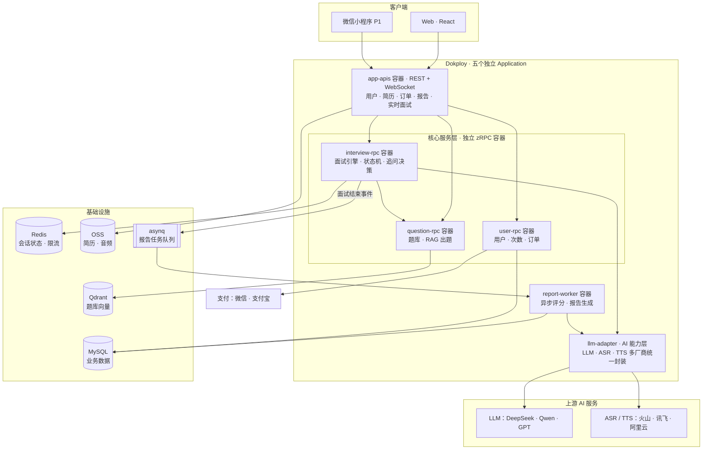
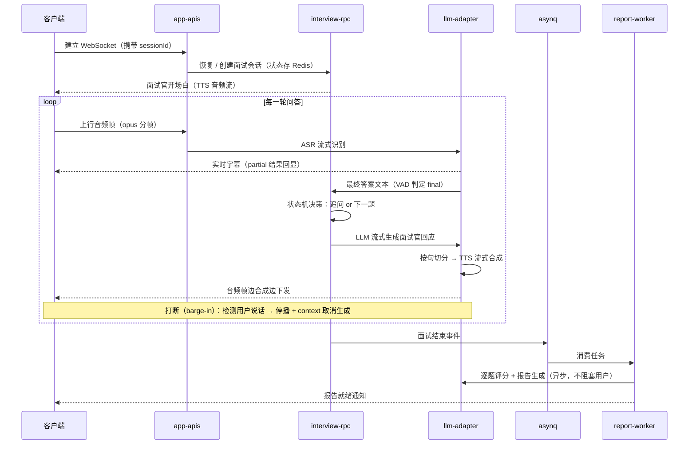
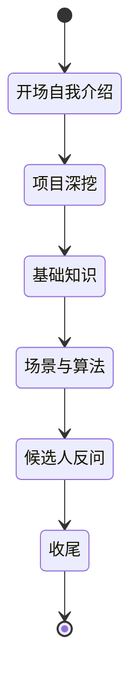

# Whetstone 磨枪 · 技术方案

> 临阵磨枪——快，而且光。
> 版本 v0.2 · 2026-08 · 状态：仓库已初始化，进入 M1 开发
> 技术栈：Go 1.22+ / go-zero / WebSocket / MySQL / Redis / Qdrant / asynq
> 仓库：`whetstone`（后端，本仓库）· `whetstone-web`（前端）
> 定位：**单人可完成**、面向个人用户（C 端）变现的开源 AI 面试陪练平台；求职展示与商业化兼顾

---

## 1. 这个项目是什么

**一句话：随时可面、面完给复盘的 AI 模拟面试平台。**

用户上传简历 + 目标 JD → AI 面试官基于项目经历与岗位要求实时提问、追问（文字或语音对话）→ 面试结束生成结构化复盘报告（逐题评分、STAR 分析、参考答案、能力雷达图）。

| 应届生的痛点 | 产品解法 |
|---|---|
| 面试机会少，上来就实战，试错成本高 | 不限次模拟，面崩了随时重来 |
| 挂了没反馈，不知道盲点在哪 | 逐题评分 + 复盘报告，盲点显性化 |
| 八股背熟了，项目深挖顶不住 | 基于简历项目的个性化追问树 |
| 语音表达紧张没地方练 | 实时语音面试，拟真压力环境 |
| 投不同岗位要不同准备 | 按 JD 定制考察点 |

**冷启动优势**：你自己就是目标用户，同学就是种子用户和传播渠道——这是个人项目最稀缺的资源。

## 2. 目标与非目标

**目标**

- M1 文字版 MVP 4-6 周单人完成，可对外使用；M2 上语音
- 技术深度对标后端面试：长连接、流式管道、异步任务、RAG、支付（见 §12）
- C 端按次/订阅付费跑通最小商业闭环

**非目标（红线与克制）**

- **不做面试实时提词/代面工具**——本质是作弊，有封号与声誉风险，坚决不碰
- 不做刷题社区（牛客的地盘）、不做真人面试撮合
- 不自研 ASR/TTS 模型，全部调云厂商流式接口

## 3. 竞品与差异化

| 产品 | 强项 | 缺口（= 我们的机会） |
|---|---|---|
| 牛客 AI 模拟面试 | 大厂真题库 + 求职流量 | 非开源；简历级个性化追问一般 |
| Final Round AI | 语音模拟成熟（海外） | 国内支付不便、价格高、中文技术面弱 |
| 即答侠 / 面试猫等国内新品 | 中文场景、上手快 | 闭源 SaaS，无自部署，同质化 |
| 各类"面试 Copilot"提词工具 | —— | 属作弊工具，不参与竞争 |

**差异化四点**：开源可自部署（获客与信任）· 简历/JD 级个性化追问（不是抽题库）· 低延迟语音管道（首响 < 2s、可打断）· 复盘报告沉淀（历史对比看成长）。

## 4. 功能清单（分期）

| 优先级 | 功能 | 说明 |
|---|---|---|
| P0 | 简历 / JD 解析 | PDF 上传 → LLM 结构化抽取项目经历与技能点 |
| P0 | 个性化出题 | 岗位题库（RAG 检索）+ 基于简历项目生成追问点 |
| P0 | 文字模拟面试 | WebSocket 流式对话，状态机驱动：提问 → 回答 → 追问（≤2 层） |
| P0 | 复盘报告 | 异步生成：逐题评分、STAR 分析、参考答案、改进建议 |
| P0 | 用户与次数 | 注册登录、免费额度、次数扣减（幂等） |
| P1 | 实时语音面试 | ASR/LLM/TTS 三级流式管道，支持打断（barge-in），实时字幕 |
| P1 | 支付 | 次数包 / 订阅，微信支付、支付宝（个人主体可先用爱发电等过渡） |
| P1 | 报告增强 | 能力雷达图、历史对比、分享海报（自传播增长） |
| P2 | 多面试官角色 | 技术面 / HR 面 / 压力面不同人设与评分维度 |
| P2 | B 端后台 | 高校就业办 / 培训机构批量测评、多租户 |
| P2 | 英文面试 | 外企场景 |

## 5. 总体架构



**服务职责**

| 服务 | 类型 | 职责 |
|---|---|---|
| app-apis | go-zero REST + WebSocket | 统一对外接入：用户 / 简历 / JD / 订单 / 报告查询，以及长连接生命周期和音频/文本流转发 |
| interview-rpc | zRPC | 面试引擎：状态机推进、追问决策、上下文管理（核心业务逻辑） |
| question-rpc | zRPC | 题库管理 + RAG 个性化出题（简历/JD 向量检索） |
| user-rpc | zRPC | 用户、次数扣减（幂等）、订单与支付回调 |
| report-worker | asynq 消费者 | 面试结束后异步逐题评分、生成报告 |
| llm-adapter | 内部模块 | LLM / ASR / TTS 多厂商统一封装——**一个 mini AI 网关**，未来可独立成库 |

> 演进策略：M1 文字模式先行（跳过 ASR/TTS，验证面试引擎与报告价值），M2 接语音管道。llm-adapter 模块与「AI 网关」项目思想同源——两个项目二选一即可，技术叙事互通。

## 6. 核心流程设计

### 6.1 实时语音面试管道（P1，技术含金量最高）



**延迟预算（端到端首响 < 2s）**：ASR final 判定 ~300ms + LLM 首 token ~500ms + TTS 首帧 ~300ms + 网络传输，按句切分让 TTS 与 LLM 生成并行。
**打断处理**：上行 VAD 检测到用户说话 → 立即停止下行播放、`context.CancelFunc` 级联取消 LLM/TTS 调用——与网关项目的取消传播是同一套功夫。

### 6.2 面试引擎状态机



- 每题内循环：提问 → 回答 → 快速评估 → 追问（≤2 层）或换题
- 追问决策：回答质量差 → 降低难度换题；回答好 → 顺着细节深挖（模拟真实面试官）
- 全部状态与对话上下文持久化 Redis：断线 30s 内重连可续面

### 6.3 个性化出题（RAG）

- 题库按岗位/知识点分类入库，embedding 进 Qdrant
- 简历解析出的项目技术栈 + JD 要求 → 混合检索（向量 + 标签过滤）→ rerank 选题
- 项目深挖题不走题库：由 LLM 基于简历项目描述现场生成追问树

### 6.4 评估与报告（异步）

- 面试中只做轻量评估（决定追问），不阻塞对话
- 结束后 asynq 任务逐题深度评分：正确性 / 深度 / 结构化 STAR / 表达，JSON Schema 输出 + 校验失败重试
- 报告聚合：能力雷达图、逐题点评与参考答案、改进清单；失败重试 + 死信告警

### 6.5 计费与防滥用

- 次数扣减：Redis 预扣 + DB 落账，`session_id` 唯一键幂等（防重复扣）
- 支付：订单状态机（创建→支付中→成功/关闭），回调验签 + 幂等入账 + 定时对账
- 防薅羊毛：手机号注册、设备/IP 维度限流、免费额度冷却期

### 6.6 成本控制（单位经济模型，估算）

一场 30 分钟语音面试 ≈ LLM 2-4 万 token（DeepSeek 约 ¥0.1-0.3）+ ASR 30 分钟（约 ¥1-2）+ TTS 数千字（约 ¥0.5-1）→ **单场成本约 ¥2-4**，支撑 ¥9.9-19.9/场 定价，毛利健康。控制手段：上下文滑动窗口压缩、系统 prompt 缓存、文字模式引流语音模式付费。

## 7. 数据模型（核心表）

| 表 | 关键字段 | 说明 |
|---|---|---|
| users | id, phone, plan | 用户 |
| resumes | user_id, oss_url, parsed_json | 解析后的结构化简历 |
| jds | user_id, title, parsed_json | 目标岗位 |
| interview_sessions | id, user_id, mode（文字/语音）, position, state, started_at, ended_at | 面试会话 |
| qa_records | session_id, seq, question, answer, followup_depth, score, feedback | 逐题记录 |
| reports | session_id, radar_json, summary, suggestions | 复盘报告 |
| credits / credit_logs | user_id, balance；log 含 session_id 唯一键 | 次数与幂等扣减流水 |
| orders | out_trade_no（唯一）, status, amount | 支付订单 |

## 8. 技术选型

| 组件 | 选择 | 理由 |
|---|---|---|
| 框架 | go-zero | api + zrpc + 内置中间件，goctl 代码生成 |
| WebSocket | coder/websocket | 轻量、context 友好，便于取消传播 |
| LLM | DeepSeek / Qwen 为主 | 中文技术面能力好、性价比高；adapter 层可换 |
| ASR / TTS | 火山引擎 / 讯飞 / 阿里云 | 国内流式接口延迟低、按量计费 |
| 向量库 | Qdrant（docker 单机）或 pgvector | 单人运维友好 |
| 任务队列 | asynq（基于 Redis） | 单人友好：重试/延迟/死信开箱即用，规模大了再评估 Kafka |
| 对象存储 | MinIO 自部署 / 阿里云 OSS | 简历与音频文件 |
| 支付 | 微信支付 / 支付宝；个人主体过渡期用爱发电、面包多 | 变现通道 |
| 前端 | React + antd（Web 先行，小程序 P1） | 快 |

## 9. 非功能设计

- **延迟**：文字模式首 token < 1s；语音端到端首响 < 2s（预算拆解见 §6.1）
- **并发**：单机 ≥ 1 万 WebSocket 长连接（自写压测客户端验证，产出报告）
- **可靠性**：会话状态 Redis 持久化，断线 30s 内可恢复续面；报告任务重试 + 死信
- **隐私安全**：简历加密存储、支持一键删除；音频默认不留存（可选留存用于复盘回放）
- **合规**：明确不提供实时面试辅助（作弊）能力，写入 README 与服务条款

## 10. 项目结构（go-zero monorepo）

```
whetstone/
├── app/
│   ├── apis/cmd/app-apis/       # 统一 REST + WebSocket 接入（:8888）
│   │   ├── desc/app.api         #   goctl API 定义
│   │   ├── etc/app-apis.yaml    #   网关与 RPC 客户端配置
│   │   └── internal/ws/
│   │       ├── conn/            #   连接管理：心跳/重连/会话恢复
│   │       └── pipeline/        #   ASR→LLM→TTS 流式编排、barge-in
│   ├── user/rpc/                # 用户/次数幂等扣减（:9001）
│   │   ├── pb/                  #   proto 与生成代码
│   │   └── client/user/         #   zRPC 客户端
│   ├── interview/rpc/           # 面试引擎：状态机/追问决策（:9002）
│   ├── question/rpc/            # 题库 + RAG 出题（:9003）
│   └── pump/cmd/report-worker/  # asynq 消费者：评分与报告
├── common/
│   └── llmadapter/              # LLM·ASR·TTS 多厂商封装（可独立开源成库）
├── deploy/                      # 本地 Compose 与 Dokploy 配置
├── Dockerfile                   # 五个服务的命名构建阶段
├── sql/                         # schema.sql 核心表 DDL
└── docs/                        # 本方案 / 架构图 / 压测报告
```

约定：`apis/cmd` 承载 BFF 接入，`<domain>/rpc` 承载业务域，`pump/cmd` 承载异步任务。桩代码统一通过 `make generate-all` 调用 goctl，并使用 `go_zero` 命名风格。前端独立仓库：`whetstone-web`（Vite + React + TS + antd）。

**M1 部署方式**：Dokploy 使用五个独立 Application，每个容器只运行一个 Go 进程。仅 `app-apis:8888` 接入对外域名，三个 RPC 通过 Dokploy 内部网络通信，Worker 独立消费异步任务。这样可以按服务独立发布、回滚、查看日志、限制资源和扩容。详细取舍见 `docs/adr/0004-dokploy-independent-applications.md`。

## 11. 里程碑

| 阶段 | 周期 | 交付物 |
|---|---|---|
| M1 文字版 MVP | 4-6 周 | 简历/JD 解析 + RAG 出题 + WebSocket 文字面试 + 复盘报告 + 次数体系；可对外用 |
| M2 语音版 | 4 周 | ASR/TTS 流式管道、打断、实时字幕；**长连接与延迟压测报告** |
| M3 变现闭环 | 3 周 | 支付、报告雷达图/分享海报、防薅羊毛；上线运营 |
| M4 扩展 | 4 周 | 多面试官角色 / B 端后台 / 英文面试（按数据反馈择一） |

## 12. 面试考点映射（本项目的「简历弹药库」）

| 模块 | 面试考点 | 你能讲到的深度 |
|---|---|---|
| WebSocket 长连接 | 网络编程、并发模型 | goroutine-per-conn 内存账、心跳与半开连接检测、优雅关闭 |
| 三级流式管道 | Go channel 编排 | ASR→LLM→TTS 背压控制、句级切分并行、打断时 context 级联取消 |
| 会话状态管理 | Redis、分布式 | 状态机持久化、断线恢复、多副本下的会话路由（sticky / 一致性哈希） |
| 异步报告 | 消息队列 | asynq 重试/延迟/死信、任务幂等、失败兜底 |
| RAG 出题 | 向量检索 | chunk 与标签混合检索、rerank、出题质量评估 |
| 支付与次数 | 分布式一致性 | 订单状态机、回调验签幂等、预扣+落账+对账 |
| 成本工程 | 工程权衡 | token 预算、上下文压缩、prompt 缓存、单位经济模型 |

**简历一句话模板**：「独立开发并开源 AI 面试陪练平台（GitHub xx star / xx 付费用户），基于 go-zero 微服务：自研 WebSocket 实时语音管道（ASR/LLM/TTS 流式编排，端到端首响 < 2s，支持打断），asynq 异步评分报告，单机压测 1 万长连接；上线 x 个月营收 ¥xxx。」——**"有真实付费用户"这句话，比多数实习经历都硬。**

## 13. 商业化路径

- **定价示例**：免费 1 场文字面试（体验钩子）→ ¥9.9/3 场 或 ¥29.9/月 语音不限次（成本模型见 §6.6）
- **获客**：同学与校园群冷启动 → 小红书/B站发「AI 模拟面试实录 + 复盘」内容（产品即内容）→ 报告分享海报自传播
- **开源策略**：核心引擎开源自部署（攒 star、建信任），SaaS 托管版收费——两者不冲突
- **B 端想象空间（P2）**：高校就业指导中心、培训机构批量测评采购
- **风险提示**：C 端付费竞品渐多（牛客、即答侠、面试猫等），拼的是执行速度与内容获客；本项目就算不赚钱，求职价值也已兑现——**下行有底，上行有空间**

## 附录 · 参考

- Final Round AI（海外标杆）：https://www.finalroundai.com/zh/ai-mock-interview
- 2026 年 AI 面试工具测评综述：https://zhuanlan.zhihu.com/p/2018862772985804482
- 技术岗 AI 面试工具算法逻辑对比：https://nanhubrain.csdn.net/6a3cf9b510ee7a33f282642d.html
- go-zero 官方文档：https://go-zero.dev
- asynq（Go 任务队列）：https://github.com/hibiken/asynq
